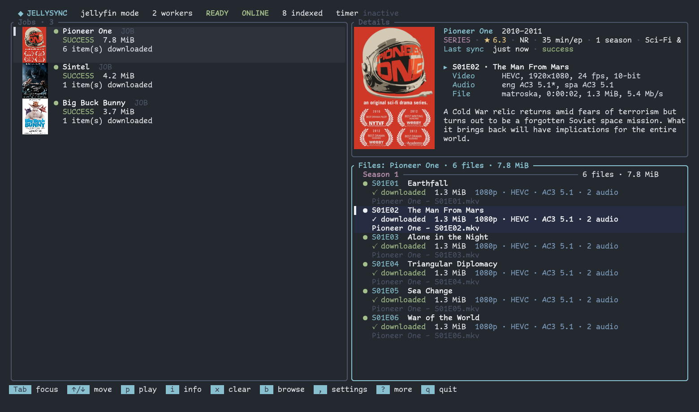

# jellysync

Jellysync is a Rust CLI for syncing media from Jellyfin or over rsync and SSH. Jellyfin HTTP downloads are the default and resume interrupted files; season, episode, and unwatched filters are supported. The rsync-over-SSH mode currently supports unfiltered jobs.



<sub>Screenshot taken against a throwaway Jellyfin server with Creative Commons media: *Pioneer One* (CC BY-NC-SA), *Sintel* and *Big Buck Bunny* (Blender Foundation, CC BY).</sub>

## Features

- 📁 Template-based path configuration with variable substitution
- 🔄 Sync specific jobs or all at once
- 🎯 Shorthand syntax for common patterns
- 🔍 Dry-run mode to preview changes
- 📊 Progress reporting with colored output
- ⚙️ Flexible YAML configuration
- 🖥️ Terminal status view and systemd service controls
- ⚡ Configurable parallel job execution (default: 2)

## Installation

### Using Nix (Recommended)

```bash
# Run directly with nix run
nix run github:pschmitt/jellysync -- --help

# Install to your profile
nix profile install github:pschmitt/jellysync

# Or add to your NixOS configuration
{
  inputs.jellysync.url = "github:pschmitt/jellysync";
  # ...
  environment.systemPackages = [ inputs.jellysync.packages.${system}.default ];
}
```

### Using Home Manager

Jellysync includes a Home Manager module for automated synchronization with systemd timers.

**1. Add jellysync to your flake inputs:**
```nix
{
  inputs = {
    nixpkgs.url = "github:NixOS/nixpkgs/nixos-unstable";
    home-manager.url = "github:nix-community/home-manager";
    jellysync.url = "github:pschmitt/jellysync";
  };
}
```

**2. Import the module in your home-manager configuration:**
```nix
{
  home-manager.users.youruser = { pkgs, ... }: {
    imports = [
      inputs.jellysync.homeManagerModules.default
    ];

    services.jellysync = {
      enable = true;

      # The package is automatically provided from the flake
      # You can override it if needed:
      # package = inputs.jellysync.packages.${pkgs.system}.default;

      settings = {
        remote = {
          hostname = "jellyfin.example.com";
          username = "jelly";
          port = 22;
          root = "/mnt/data/videos";
          directories = {
            movies = "movies";
            tv_shows = "tv_shows";
          };
        };

        local = {
          root = "~/Videos";
          directories = {
            movies = "Movies";
            tv_shows = "TV Shows";
          };
        };

        jobs = {
          "Pioneer One" = {
            remote_dir = "$tv_shows/Pioneer One";
            local_dir = "$tv_shows/Pioneer One";
          };
          "Night of the Living Dead" = {
            directory = "movies";
          };
          "The Long-Running Show" = {
            directory = "tv_shows";
            seasons = "latest-2";
          };
        };
      };

      # Sync schedule (systemd timer format)
      schedule = "*-*-* 03:00:00";  # Daily at 3 AM

      # Run missed jobs after system restart
      persistent = true;

      # Optional: sync only specific jobs
      jobNames = [ "Pioneer One" "Night of the Living Dead" ];
    };
  };
}
```

**Module Options:**

| Option | Type | Default | Description |
|--------|------|---------|-------------|
| `enable` | bool | `false` | Enable the jellysync service |
| `package` | package | *(auto)* | The jellysync package (automatically provided from flake) |
| `settings` | attrs | - | Configuration settings (see Configuration section) |
| `schedule` | string | `"hourly"` | Systemd timer schedule (OnCalendar format, not cron) |
| `persistent` | bool | `true` | Run missed jobs after system restart |
| `jobNames` | list of strings | `[]` | Specific jobs to sync (empty = all jobs) |

**Schedule Examples:**

```nix
# Every hour (default)
schedule = "hourly";

# Daily at 3 AM
schedule = "*-*-* 03:00:00";

# Every 6 hours
schedule = "*-*-* 0/6:00:00";

# Twice daily (6 AM and 6 PM)
schedule = "*-*-* 06,18:00:00";

# Every Monday at 2 AM
schedule = "Mon *-*-* 02:00:00";
```

**What it does:**
- Creates `~/.config/jellysync/config.yaml` with your settings
- Installs jellysync package (automatically from the flake)
- Sets up systemd user service and timer
- Automatically syncs on schedule

**Note:** The `package` option is optional and automatically defaults to the package provided by the jellysync flake. You only need to set it if you want to use a different version or build.

### Commands

```console
jellysync                     # Open the TUI (same as `jellysync tui`)
jellysync download [JOB]...   # Download all jobs or selected ones (aliases: fetch, sync)
jellysync download auto       # Download the newest unwatched items (--max-items, --max-size)
jellysync status              # Show recent job status and timer state
jellysync prune [JOB]...      # Delete removed media and watched files past their grace period
jellysync prune --dry-run     # Only show what prune would delete (also -k, --dryrun)
jellysync start               # Start the user systemd service
jellysync stop                # Stop the user systemd service
jellysync config              # Print the parsed config
```

Ad-hoc library downloads started from Explore run in a detached background
worker, so they keep going after the TUI exits. Interrupted ones (e.g. the
worker died) are resumed automatically when the TUI starts and Jellyfin is
reachable, and by every full `jellysync download` (such as the systemd timer).
Select a
file and press `p` (or double-click it) to launch the configured player
(default: `mpv`); set `player` in the YAML or Home Manager settings to change
it. `Ctrl-C` closes Explore, and pressing it twice in the main view quits the
TUI. Press `x` on an ad-hoc job in the Jobs list to delete its tracked files and
remove it from the list. Press `o` to open the selected show's or movie's
download directory (or, with a file focused, its folder) with `file_manager`
(default: `xdg-open`, falling back to `gio open`).

The TUI works offline. It pings Jellyfin (`/System/Ping`) in the background and
shows `ONLINE`/`OFFLINE` in the header; while offline, local files, playback,
media info and clearing keep working, and browsing (plus syncing in `jellyfin`
mode) is disabled with a notice instead of failing. Reconciliation and poster
loading start once Jellyfin becomes reachable.

In Explore, `Tab`, `→` or `Enter` moves focus from the library to the details
pane of the selected show; there, `↑`/`↓` move through episodes, `Space`
selects one, `a` selects all, and `d` or `Enter` downloads the selection
(`Enter` on a movie downloads it). In the library pane every printable key goes to the search; `Ctrl-F` cycles the type filter. `Tab`, `←` or `Esc` returns to the
library and `q` closes Explore from the details pane (in the library pane `q` goes to the search); after closing Explore, the main view selects the job and file you just
queued.

When the terminal is tall enough, a Details panel sits above the Files list:
the show's or movie's poster, title, years, rating, runtime, genres, tagline and
overview from Jellyfin, plus the `ffprobe` streams (video, audio, subtitles,
container) of the selected file. Show files are grouped under season headings
(with file count, progress and size) and ordered by episode, and their rows use
the Jellyfin episode title; each downloaded file shows short badges such as
`1080p · HEVC · EAC3 5.1`. Files are probed locally in the background, so this
also works offline (without the Jellyfin metadata).

In the Files list, `Space` pauses a queued or running download (keeping its
partial file and freeing its worker slot for the next queued one) and resumes a
paused one. Paused downloads are not resumed automatically.

Use `--config FILE` to select a config and `-j N` (`--parallelism`, `--parallel`) to override the worker limit for a download.

`Ctrl-C` closes the open dialog (help, job config, file info, clear
confirmation, Explore) without counting towards quitting; two more `Ctrl-C`
presses in the main view quit, as does `q`. `Esc` only closes dialogs. Dialogs
are modal: keys and clicks other than their own do nothing while one is open.
`PgUp`/`PgDn`/`Home`/`End` jump through the focused list, and the footer only
lists keys that apply to the focused panel. The clear confirmation names the
exact files it will delete (fixed when you press `x`/`X`/`c`); `X` clears the
season group shown in the list. Footer notices disappear after a few seconds.

### Development

Run `just` to list the development recipes. Compiling and Nix builds run on a
remote build host (`rofl-13` by default, override with `just <recipe> host`):
`just build`, `just release`, `just test`, `just clippy`, `just nix-build`,
`just nix-check`; `just lint` runs the format checks, `statix`/`deadnix` and
clippy, and `just check` runs everything.

`just screenshot` retakes `docs/screenshot.png` on the build host (it needs
Docker there): it starts a throwaway Jellyfin container holding only Creative
Commons media, syncs it with a throwaway config and captures the TUI in a real
kitty under a virtual X server. The TUI draws its icons with Nerd Font glyphs.
By default it uses ComicCode Nerd Font, copied from this machine's fonts (found
via `fc-list`) since it can't live in this repository; without it the script
falls back to JetBrainsMono Nerd Font Mono. Pass another family (and optionally
its font directory) to override, e.g.
`just screenshot rofl-13 "Iosevka Nerd Font Mono" ~/fonts/iosevka`.

### Manual Installation

Install the flake package with Nix, then copy `jellysync-config.sample.yaml` to `~/.config/jellysync/config.yaml` and configure it.

GitHub Releases publish archives for Linux x86_64 (glibc and musl), macOS Apple Silicon, and Android aarch64 for Termux. In Termux, extract the `aarch64-linux-android` archive and copy `jellysync` into `$PREFIX/bin`.

## Configuration

Create a `jellysync.yaml` file with your sync configuration:

```yaml
remote:
  hostname: jellyfin.example.com
  username: jelly
  port: 22
  root: /mnt/data/videos
  directories:
    tv_shows: tv_shows
    movies: movies
    documentaries: documentaries

local:
  root: ~/Videos
  directories:
    tv_shows: "TV Shows"
    movies: Movies
    documentaries: ~/Documentaries

# Required for Jellyfin download mode. Keep the API key in a secret
# file and point api_key_file at it; never put the key in this config.
jellyfin:
  base_url: https://jellyfin.example.com
  api_key_file: /run/secrets/jellyfin/api-key
  username: jelly
  # Optional when Jellysync can resolve username through the API.
  user_id: 0123456789abcdef0123456789abcdef

library:
  season_pattern: "Season $season_number"

rsync:
  flags:
    - -a
    - -v
    - -z

download:
  mode: jellyfin # jellyfin (HTTP, default) or rsync (SSH)

parallelism: 2 # Concurrent jobs; default is 2
player: mpv # TUI player command; default is mpv
file_manager: xdg-open # TUI `o` command; default is xdg-open, then gio open

jobs:
  # Sync all of Pioneer One (explicit paths)
  - name: Pioneer One
    remote_dir: $tv_shows/Pioneer One
    local_dir: $tv_shows/Pioneer One

  # Sync a movie (shorthand syntax)
  - name: Night of the Living Dead
    directory: movies

  # Sync season 1 into a custom folder
  - name: The Long-Running Show
    remote_dir: "$tv_shows/$name/Season 1"
    local_dir: "$tv_shows/The Long-Running Show - Season 1"

  # Sync seasons 1-10 (range)
  - name: Example Anthology
    directory: tv_shows
    seasons: "1-10"

  # Sync only episodes marked unplayed by this Jellyfin user
  - name: The Weekly Show
    directory: tv_shows
    seasons: latest-2
    unwatched: true

  # Sync the latest season
  - name: Example Comedy
    directory: tv_shows
    seasons: latest

  # Sync season 13 and any later seasons
  - name: Example Soap
    directory: tv_shows
    seasons: "13+"

  # Sync specific seasons (list)
  - name: Example Drama
    directory: tv_shows
    seasons: [1, 2, 5]

  # Sync a Blender open movie
  - name: Sintel
    directory: movies

  # Sync using wildcards (resolves to first match)
  - name: "Pioneer One (2010)"
    remote_dir: "$tv_shows/Pioneer One*"
    local_dir: "$tv_shows/Pioneer One (2010)"
```

Jellyfin is the default `download.mode`. The HTTP downloader keeps interrupted data in `.partial` files and resumes from the saved byte offset with an HTTP Range request. If the server declines the range, Jellysync restarts that file from byte zero. `parallelism` defaults to two concurrent transfers.

### Configuration Sections

#### Remote Section

| Setting | Required | Default | Description |
|---------|----------|---------|-------------|
| `hostname` | Yes | - | SSH server hostname or IP address |
| `username` | Yes | - | SSH username for authentication |
| `port` | No | 22 | SSH port number |
| `root` | Yes | - | Base directory on remote server (all remote paths are relative to this) |
| `directories` | No | - | Named directory mappings for use in templates |

**Example:**
```yaml
remote:
  hostname: jellyfin.example.com
  username: jelly
  port: 22
  root: /mnt/data/videos
  directories:
    tv_shows: tv_shows        # -> /mnt/data/videos/tv_shows
    movies: movies            # -> /mnt/data/videos/movies
```

#### Local Section

| Setting | Required | Default | Description |
|---------|----------|---------|-------------|
| `root` | Yes | - | Base directory on local machine (supports `~` and `$HOME` expansion) |
| `directories` | No | - | Named directory mappings for use in templates |

**Notes:**
- Supports tilde (`~`) and `$HOME` environment variable expansion
- Directory paths can be relative (to `root`) or absolute
- Absolute paths in `directories` override the `root` setting

**Example:**
```yaml
local:
  root: ~/Videos
  directories:
    tv_shows: "TV Shows"           # Relative -> ~/Videos/TV Shows
    movies: Movies                 # Relative -> ~/Videos/Movies
    documentaries: ~/Documentaries # Absolute -> ~/Documentaries
```

#### Jellyfin Section

Required when jobs use Jellyfin library sync. Jellysync uses a Jellyfin API key and a user ID to query media and per-user watched status. Store the API key in a separate readable file, such as a SOPS-managed secret.

| Setting | Required | Description |
|---------|----------|-------------|
| `base_url` | Yes | Jellyfin server base URL, without a trailing slash |
| `api_key_file` | Recommended | Path to a file containing a Jellyfin API key |
| `user_id` | No | Jellyfin user ID; otherwise resolved from `username` |
| `username` | With API key or password | Jellyfin account used for watched status and user lookup |
| `password_file` | Legacy only | Path to a file containing that account's password |

Jellysync sends the API key using Jellyfin's `Authorization: MediaBrowser` header. The key stays in memory for the run and is never written to the state database.

#### Library Section

| Setting | Required | Default | Description |
|---------|----------|---------|-------------|
| `season_pattern` | No | `"Season $season_number"` | Pattern for season directory names |
| `episode_pattern` | No | `"E$episode_number"` | Pattern for episode file names |

**Season Pattern:**

Available Variables:
- `$name` - Show name (from job name)
- `$season_number` - Season number (1, 2, 3, etc.)

Pattern Examples:
```yaml
library:
  # Default pattern
  season_pattern: "Season $season_number"
  # Results: "Season 1", "Season 2", "Season 3"

  # Include show name
  season_pattern: "$name - Season $season_number"
  # Results: "Pioneer One - Season 1", "Pioneer One - Season 2"

  # Short format
  season_pattern: "S$season_number"
  # Results: "S1", "S2", "S3"
```

**Episode Pattern:**

Available Variables:
- `$episode_number` - Episode number (1, 2, 3, etc.)

Pattern Examples:
```yaml
library:
  # Default pattern
  episode_pattern: "E$episode_number"
  # Matches: "E01", "E02", "E10"

  # Full word pattern
  episode_pattern: "Episode $episode_number"
  # Matches: "Episode 01", "Episode 02"

  # Common S##E## pattern
  episode_pattern: "S[0-9]+E$episode_number"
  # Matches: "S01E01", "S02E05"
```

**Notes:**
- `season_pattern` is used when `seasons` filtering is specified in jobs
- `episode_pattern` is used when `episodes` filtering is specified in jobs
- Patterns are used to find and match directories/files on remote server
- Must match the actual naming structure on your media server

#### Rsync Section

| Setting | Required | Default | Description |
|---------|----------|---------|-------------|
| `flags` | No | `-a -v -z` | Array of rsync command-line flags |

**Notes:**
- If not specified, uses default flags: `-a -v -z`
- Common flags: `--progress`, `--bwlimit=RATE`, `--exclude=PATTERN`
- SSH connection flags (`-e "ssh -p PORT"`) are added automatically

**Example:**
```yaml
rsync:
  flags:
    - -a              # Archive mode
    - -v              # Verbose
    - -z              # Compress
    - --progress      # Show progress
    - --bwlimit=5000  # Limit bandwidth to 5000 KB/s
```

#### Jobs Section

Each job defines a sync operation.

**Job Options:**

| Option | Required | Type | Description |
|--------|----------|------|-------------|
| `name` | Yes | string | Name of the job (used in templates as `$name`) |
| `jellyfin_name` | No | string | Jellyfin title to search when it differs from the job name |
| `remote_dir` | No | string | Remote directory path (supports templates and wildcards) |
| `local_dir` | No | string | Local directory path (supports templates) |
| `directory` | No | string | Shorthand: expands to `$directory/$name` for both remote and local |
| `seasons` | No | string or array | Season filter: `"latest"`, `"1-10"`, or `[1, 2, 3]` |
| `episodes` | No | string or array | Episode filter: `"latest"`, `"1-10"`, or `[1, 2, 3]` |
| `wildcard` | No | boolean | If `true`, adds `*name*` pattern to remote path |
| `unwatched` | No | boolean | If `true`, syncs episodes marked unplayed by the configured Jellyfin user |
| `enabled` | No | boolean | `false` skips the job when syncing all jobs; it still runs when named (default `true`) |
| `delete_watched` | No | boolean | Delete downloaded files once watched, after the grace period; watched items are not downloaded again |
| `delete_watched_after` | No | duration | Grace period for this job, overriding `cleanup.delete_watched_after` (e.g. `3d`, `12h`, `0`) |
| `auto` | No | `true`/`all`, `movies`, `shows` | Instead of a title: the newest unwatched movies and/or episodes (see [Auto jobs](#auto-jobs)) |
| `max_items` | No | number | Auto jobs: keep at most this many items (5 when no limit is set) |
| `max_size` | No | number | Auto jobs: size budget in GiB |
| `library` | No | string | Auto jobs: only pick from this Jellyfin library |

**Season Filtering:**

The `seasons` option allows selective syncing of TV show seasons:

| Format | Example | Description |
|--------|---------|-------------|
| String (latest) | `"latest"` | Syncs only the most recent season |
| String (latest-N) | `"latest-3"` | Syncs the latest 3 seasons |
| String (range) | `"1-10"` | Syncs seasons 1 through 10 (inclusive) |
| String (open range) | `"13+"` (or `"13-"`) | Syncs season 13 and every later one |
| String (up to) | `"-5"` | Syncs seasons up to 5 |
| String (several) | `"1, 3-4, 10+"` | Combines the forms above |
| Array (list) | `[1, 2, 5]` | Syncs only seasons 1, 2, and 5 |

**Notes:**
- Season directories are matched using the `library.season_pattern` setting
- Default pattern is `"Season $season_number"` (e.g., "Season 1", "Season 2")
- Pattern must match actual directory names on remote server

**Episode Filtering:**

The `episodes` option allows selective syncing of episodes within seasons:

| Format | Example | Description |
|--------|---------|-------------|
| String (latest) | `"latest"` | Syncs only the most recent episode |
| String (latest-N) | `"latest-5"` | Syncs the latest 5 episodes |
| String (range) | `"1-10"` | Syncs episodes 1 through 10 (inclusive) |
| Array (list) | `[1, 2, 5]` | Syncs only episodes 1, 2, and 5 |

**Notes:**
- Episode files are matched using the `library.episode_pattern` setting
- Default pattern is `"E$episode_number"` (e.g., "E01", "E02")
- Can be combined with `seasons` to filter both seasons and episodes
- Can be used without `seasons` for single-directory content
- Pattern must match actual file names on remote server
- `unwatched: true` requires the Jellyfin section and cannot be combined with `episodes`; it can be combined with `seasons`
- If `seasons` is omitted, `unwatched: true` scans all seasons

**Syntax options:**

| Option | Description | Use Case |
|--------|-------------|----------|
| **Explicit paths** | Define both `remote_dir` and `local_dir` | When remote and local paths differ |
| **Shorthand** | Use `directory` key only | When both sides have the same relative path |
| **Templates** | Use `$name` and `$directory` variables | For dynamic path construction |

**1. Explicit paths:**
```yaml
- name: My Show
  remote_dir: $tv_shows/My Show
  local_dir: $tv_shows/My Show
```

**2. Shorthand syntax:**
```yaml
- name: My Show
  directory: tv_shows  # Expands to $tv_shows/$name on both remote and local
```

**3. Template variables:**
- `$name`: Replaced with job name
- `$tv_shows`, `$movies`, etc.: Replaced with directory mappings

```yaml
- name: The Long-Running Show
  remote_dir: "$tv_shows/$name/Season 1"
  local_dir: "$tv_shows/$name - Season 1"
```

**4. Wildcard support:**
Remote paths support wildcards (`*` and `?`) for pattern matching. The first matching directory will be used.

```yaml
# Explicit wildcard pattern
- name: Pioneer One (2010)
  remote_dir: "$tv_shows/Pioneer One*"  # Resolves to first match, e.g., "Pioneer One (2010)"
  local_dir: "$tv_shows/Pioneer One (2010)"

# Wildcard flag (automatically adds *name* pattern)
- name: Pioneer One
  directory: tv_shows
  wildcard: true  # Will match *Pioneer One* on remote
```

**5. Season and Episode Filtering:**

Combine season and episode filters for precise control:

```yaml
# Sync episodes 1-5 of season 1
- name: Example Sitcom
  directory: tv_shows
  seasons: "1"
  episodes: "1-5"

# Sync latest episode from seasons 1 and 2
- name: Example Comedy
  directory: tv_shows
  seasons: [1, 2]
  episodes: "latest"

# Sync latest 3 episodes from latest 2 seasons
- name: The Long-Running Show
  directory: tv_shows
  seasons: "latest-2"
  episodes: "latest-3"

# Sync specific episodes from latest season
- name: Example Drama
  directory: tv_shows
  seasons: "latest"
  episodes: [1, 2, 10]

# Episodes without seasons (single directory)
- name: Open Movie Collection
  remote_dir: "$movies/Open Movie Collection"
  local_dir: "$movies/Open Movie Collection"
  episodes: "1-3"
```

## Usage

```bash
jellysync --help
jellysync download
jellysync download "Pioneer One"
jellysync download "Pioneer One" Sintel
jellysync status
jellysync tui
jellysync prune --dry-run
jellysync prune --watched
jellysync --config /path/to/config.yaml config
```

`jellysync status` and the TUI draw their state icons with
[Nerd Font](https://www.nerdfonts.com/) (Material Design) glyphs, so use a
terminal font patched with them.

## Options

- `-c, --config FILE`: Specify config file path (default: `jellysync.yaml`)
- `--parallelism N`: Override the concurrent worker limit
- `sync [JOB...]`: Sync all jobs or selected jobs
- `status`: Show latest job state and systemd timer state
- `version` (also `--version`, `-V`): Print the version: `1.1.0` for a tagged release, `1.1.0-<commit>` otherwise and `1.1.0-<commit>-dirty` with uncommitted changes to the sources (Nix builds always name the commit; flakes cannot see tags). `--json version` prints it as JSON.
- `completions <SHELL>`: Print a completion script for bash, zsh, fish, elvish or powershell. The Nix package installs the bash, zsh and fish completions, so they work out of the box with the Home Manager module; elsewhere, e.g. `jellysync completions zsh > ~/.zfunc/_jellysync`.
- `prune [-k|--dry-run] [--watched] [JOB...]`: Delete tracked files whose media is gone from Jellyfin, and watched files past their grace period in jobs with `delete_watched` (`--watched`: in every selected job). `-k`/`--dry-run`/`--dryrun` only lists what would be deleted, plus watched files still in their grace period. Without Jellyfin it works from the local watched state and skips the removed-media check. **prune deletes by default now**; the old `--apply` flag is accepted and ignored.
- `tui`: Select a job to see its files; `s` syncs that job, `S` syncs all jobs, `b` opens Jellyfin Explore, and `o` opens the job's download directory. Explore searches the library, renders posters with `ratatui-image` (including Kitty graphics protocol support), shows a series' episodes in the details pane (`Tab` to focus, `Space`/`a` to select), and downloads movies or selected episodes with `d`. In the main view, `x` deletes the focused file (a later sync may download it again), `X` deletes it and makes syncs ignore it, and `c` deletes and ignores the whole show (all after a `y` confirmation); `x` on an ad-hoc job in the Jobs list removes it. `I` toggles ignoring the focused file without deleting it. `w` toggles the focused file watched (in the Jobs list: the whole job) and `W` its season (see [Watched state and cleanup](#watched-state-and-cleanup)). `p` or a double-click plays a file. `i` opens the job configuration, where its sync settings can be edited (see [Settings overlay](#settings-overlay-editing-from-the-tui)), or, with a file selected, `i`/`Enter` show a short `ffprobe` summary (container, duration, size, bitrate, video/audio/subtitle streams), plus the episode still, title, air date, rating, runtime, watched state and overview from Jellyfin when online; `p` plays the file from there. Mouse clicks and scrolling select rows.
- `-h, --help`: Show help message
- `--version`: Show version

## Auto jobs

An auto job downloads whatever is new in Jellyfin instead of a named title: the
newest unwatched movies and/or episodes by date added, up to `max_items`
and/or `max_size` (GiB). Without either limit it keeps 5 items. Several auto
jobs can split the work, each with its own limits:

```yaml
jobs:
  - name: New movies
    auto: movies
    max_items: 10

  - name: New episodes
    auto: shows        # or `true` / `all` for both
    max_size: 30       # GiB
    library: TV Shows  # optional: only this Jellyfin library
```

- Items are picked newest first; one too big for the space left is skipped so
  smaller, older items can still fill it.
- Files land where ad-hoc downloads go: `<local.root>/Movies/<Title>/…` and
  `<local.root>/TV Shows/<Series>/Season N/…`.
- When newer items push one out of the window, its file is deleted on the next
  sync. Watched items leave through the watched cleanup instead: auto jobs
  delete watched files after the grace period unless `delete_watched: false`.
- Items another job already downloads are skipped, so jobs never fight over a
  file. Ignored items are skipped too.

`jellysync download auto` works without any configuration: it syncs a job
named `auto` if there is one, and otherwise an implicit auto job for all media.
`--max-items N` and `--max-size GIB` override the limits of the auto jobs
being synced (one CLI limit replaces both configured ones):

```bash
jellysync download auto --max-items 3
jellysync download "New episodes" --max-size 50
```

In the TUI, `i` on a job toggles **Auto** (off/all/movies/shows) and edits an
auto job's limits and library.

## Watched state and cleanup

jellysync keeps the Jellyfin user's played state for every tracked file in its
state database, so the TUI shows it offline too:

- file rows show a watched (eye) icon, season headings `N watched`, and job rows
  `N/M watched`; the Details panel has a *Watched* line;
- `w` toggles the focused file watched (in the Jobs list: the whole job) and
  `W` its season. Marks made offline are shown as *not synced* and sent to
  Jellyfin once it is reachable (the TUI syncs every minute while online, and
  `download` and `prune` sync first). A local mark wins over Jellyfin's state
  until it has been sent.

Jobs with `delete_watched: true` clean up after themselves: `jellysync
download` (and so the timer) deletes their watched files once the grace period
is over, and never downloads watched items again. The grace period defaults to
7 days from when the item was played (`LastPlayedDate` in Jellyfin, or when
jellysync first saw it watched); the TUI shows the countdown (`deleted in 5d`).

```yaml
cleanup:
  delete_watched_after: 7d   # default; 12h, 30m or 0 work too (a bare number means days)

jobs:
  - name: Pioneer One
    directory: tv_shows
    delete_watched: true
    delete_watched_after: 2d  # overrides the global grace period
```

`jellysync prune --watched` applies the same cleanup to every selected job,
with or without `delete_watched`.

### Ignoring items

Deleting a file with `X` (or a whole show with `c`) in the TUI also makes
syncs ignore it, so it does not come back with the next sync; `x` only deletes.
`I` toggles ignoring a file without deleting it. Ignored files stay in the Files
list, dimmed, and `I` there syncs them again.

## Configuration File Locations

jellysync uses the first configuration file it finds:

1. **`--config FILE`**
2. **`JELLYSYNC_CONFIG` environment variable**
3. **`./jellysync.yaml`** (current directory)
4. **`~/.config/jellysync/config.yaml`** (user config directory; the Home Manager module writes it)

```bash
jellysync --config /path/to/config.yaml status
JELLYSYNC_CONFIG=~/my-config.yaml jellysync download
```

### Settings overlay (editing from the TUI)

Press `,` in the TUI for the Settings screen:

- **General, Jellyfin, remote, local**: download mode, parallel transfers,
  player, file manager, Jellyfin URL, user, API key or password file, SSH host,
  user, port and root, the download root, season folder pattern and rsync flags.
  `Enter` edits a field (or cycles a choice), `Del` clears it, and `r` resets it
  to the configuration file's value.
- **Jobs**: `Enter` opens a job's sync settings, `Space` enables or disables it
  (disabled jobs are skipped when syncing all jobs but still run when named),
  `d` deletes it (downloaded files stay on disk), and `a` adds a job in one of
  the library folders.
- **Everything else**, such as the `directories` maps: `E` (also in the main
  view) opens the file in `$VISUAL`/`$EDITOR` (default `vi`) and reloads it
  when the editor exits.

`i` on a job edits the same sync settings directly: enabled, Jellyfin name,
seasons, episodes, delete watched, its grace period and unwatched-only (plus
wildcard in rsync mode). Invalid
values, such as a bad filter or a cleared required option, are rejected before
anything is saved.

Edits go into the configuration file when it is writable. When it is read-only,
as with the Nix store symlink the Home Manager module creates, they go into a
settings overlay at `$XDG_STATE_HOME/jellysync/config.yaml` (usually
`~/.local/state/jellysync/config.yaml`), next to the state database.

Every command (the TUI, `download`, the systemd timer, `prune`) loads the
configuration file and then merges the overlay on top of it, if the overlay exists:

- mappings merge key by key;
- jobs merge by `name` (an overlay entry for an unknown name adds a job);
- `null` unsets a value (`seasons: null` means all seasons);
- any other value replaces the one from the configuration file.

```yaml
# ~/.local/state/jellysync/config.yaml
jobs:
  - name: Pioneer One
    seasons: latest-2
    unwatched: true
```

Settings set by the overlay show as *overridden* in the TUI; `r` removes the
override so the Nix-managed value applies again. Jobs from a read-only config
cannot be deleted, only disabled; jobs added in the TUI live in the overlay and
can be deleted. `E` opens the overlay when the config is read-only. Delete the
overlay to make the Nix configuration fully authoritative again.
`jellysync status` shows the overlay's path when one exists.

## Environment Variables

- `JELLYSYNC_CONFIG`: Override config file path (highest priority)

## How It Works

1. Reads YAML configuration file
2. Expands path templates with variables
3. Resolves relative/absolute paths
4. Uses `rsync` over SSH to sync files
5. Creates local directories as needed

### Rsync Options

The Rust tool uses these rsync options:
- `-a`: Archive mode (preserves permissions, timestamps, etc.)
- `-v`: Verbose output (or `--info=progress2` in non-verbose mode)
- `-z`: Compress during transfer
- `--partial`: Keep interrupted transfers so a later run can resume them

## Examples

### Sync Everything
```bash
jellysync download
```

### Sync One Show
```bash
jellysync download "Pioneer One"
```

### Preview Changes
```bash
jellysync prune --dry-run
```

### Sync Multiple Specific Jobs
```bash
jellysync download "Pioneer One" Sintel "Big Buck Bunny"
```

## Requirements

- Jellysync Rust executable
- `rsync`
- `ssh` access to remote server
- SSH key authentication recommended

**Note:** When using Nix, all dependencies are automatically provided.

## Tips

- Set up SSH key authentication to avoid password prompts
- Use `jellysync prune --dry-run` to preview deletions before running `jellysync prune`
- Absolute paths in `local.directories` override the `local.root`

## License

This project is licensed under the GNU General Public License v3.0 (GPLv3).

See [LICENSE](LICENSE) for details.
